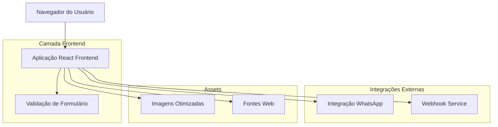
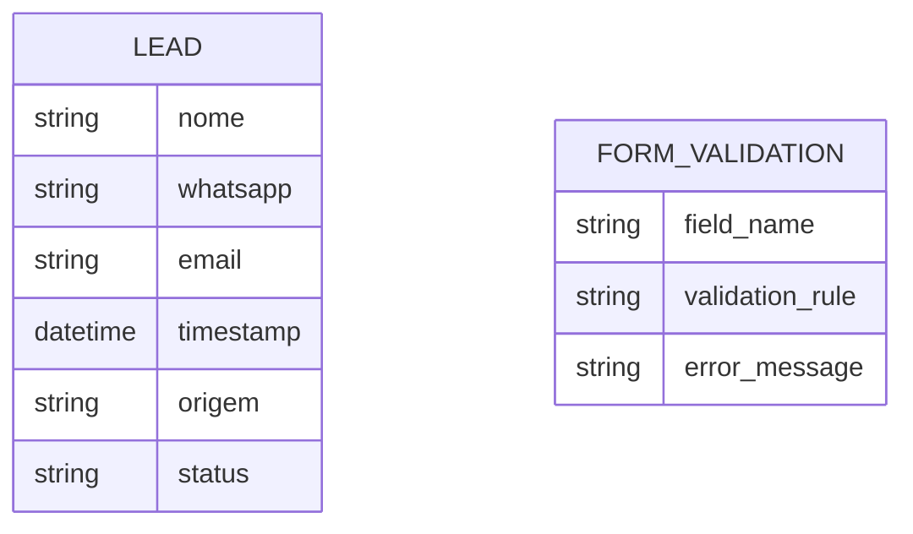

# Documento de Arquitetura Técnica - Landing Page Dra. Roberttà Simone

## 1. Design da Arquitetura



## 2. Descrição das Tecnologias

- **Frontend**: React@18 + TypeScript + Tailwind CSS + Vite
- **Validação**: React Hook Form + Zod para validação de schema
- **Otimização**: Lazy loading de imagens, compressão WebP
- **Deploy**: Vercel ou Netlify para hospedagem estática

## 3. Definições de Rotas

| Rota | Propósito |
|------|----------|
| / | Página principal da landing page com todas as seções |
| /obrigado | Página de agradecimento após envio do formulário (opcional) |

## 4. Definições de API

### 4.1 API Principal

**Envio de Lead via Webhook**
```
POST [URL_WEBHOOK_A_SER_FORNECIDO]
```

Request:
| Nome do Parâmetro | Tipo | Obrigatório | Descrição |
|-------------------|------|-------------|----------|
| nome | string | true | Nome completo do lead |
| whatsapp | string | true | Número do WhatsApp com DDD |
| email | string | true | Email válido do lead |
| timestamp | string | true | Data/hora do envio |
| origem | string | true | Identificador da landing page |

Response:
| Nome do Parâmetro | Tipo | Descrição |
|-------------------|------|----------|
| success | boolean | Status do envio |
| message | string | Mensagem de retorno |

Exemplo de Request:
```json
{
  "nome": "Maria Silva",
  "whatsapp": "11999887766",
  "email": "maria@email.com",
  "timestamp": "2024-01-15T10:30:00Z",
  "origem": "landing-page-dra-roberta"
}
```

**Redirecionamento WhatsApp**
```
GET https://wa.me/[NUMERO_WHATSAPP_DRA_ROBERTA]
```

Parâmetros:
| Nome do Parâmetro | Tipo | Descrição |
|-------------------|------|----------|
| text | string | Mensagem pré-formatada com dados do lead |

Exemplo:
```
https://wa.me/5511999887766?text=Olá%20Dra.%20Roberttà!%20Meu%20nome%20é%20Maria%20Silva%20e%20gostaria%20de%20agendar%20uma%20consulta.%20Meu%20email%20é%20maria@email.com
```

## 5. Modelo de Dados

### 5.1 Definição do Modelo de Dados



### 5.2 Estrutura de Validação

**Schema de Validação do Formulário (Zod)**
```typescript
const leadSchema = z.object({
  nome: z.string()
    .min(2, 'Nome deve ter pelo menos 2 caracteres')
    .max(100, 'Nome deve ter no máximo 100 caracteres')
    .regex(/^[a-zA-ZÀ-ÿ\s]+$/, 'Nome deve conter apenas letras e espaços'),
  
  whatsapp: z.string()
    .regex(/^\(?\d{2}\)?[\s-]?9?\d{4}[\s-]?\d{4}$/, 'Formato de WhatsApp inválido')
    .transform(val => val.replace(/\D/g, '')), // Remove caracteres não numéricos
  
  email: z.string()
    .email('Email inválido')
    .max(255, 'Email deve ter no máximo 255 caracteres')
});

type LeadFormData = z.infer<typeof leadSchema>;
```

**Configuração de Ambiente**
```typescript
// .env.example
VITE_WEBHOOK_URL=https://webhook.exemplo.com/lead
VITE_WHATSAPP_NUMBER=5511999887766
VITE_ANALYTICS_ID=GA_MEASUREMENT_ID
```

## 6. Estrutura de Arquivos

```
src/
├── components/
│   ├── Hero/
│   │   ├── Hero.tsx
│   │   └── Hero.module.css
│   ├── About/
│   │   ├── About.tsx
│   │   └── About.module.css
│   ├── Services/
│   │   ├── Services.tsx
│   │   └── Services.module.css
│   ├── ContactForm/
│   │   ├── ContactForm.tsx
│   │   ├── ContactForm.module.css
│   │   └── useContactForm.ts
│   └── common/
│       ├── Button/
│       ├── Input/
│       └── Loading/
├── hooks/
│   ├── useFormValidation.ts
│   └── useWebhook.ts
├── services/
│   ├── webhookService.ts
│   └── whatsappService.ts
├── utils/
│   ├── validation.ts
│   ├── formatters.ts
│   └── constants.ts
├── assets/
│   ├── images/
│   └── icons/
├── styles/
│   ├── globals.css
│   └── variables.css
├── App.tsx
└── main.tsx
```

## 7. Considerações de Performance

- **Otimização de Imagens**: Conversão automática para WebP, lazy loading
- **Code Splitting**: Carregamento assíncrono de componentes não críticos
- **Minificação**: Build otimizado com Vite para produção
- **CDN**: Uso de CDN para assets estáticos
- **Lighthouse Score**: Meta de 90+ em Performance, Accessibility e SEO

## 8. Segurança e Privacidade

- **Validação Client-side e Server-side**: Dupla validação dos dados
- **HTTPS**: Obrigatório para todas as comunicações
- **LGPD**: Aviso de coleta de dados e política de privacidade
- **Rate Limiting**: Prevenção de spam no formulário
- **Sanitização**: Limpeza de dados antes do envio